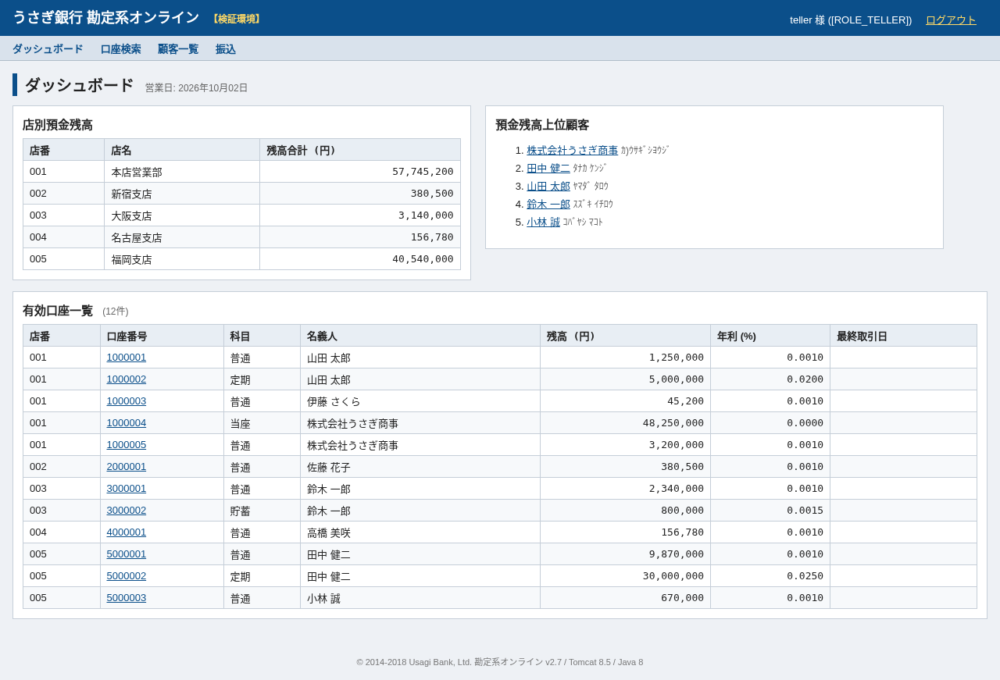
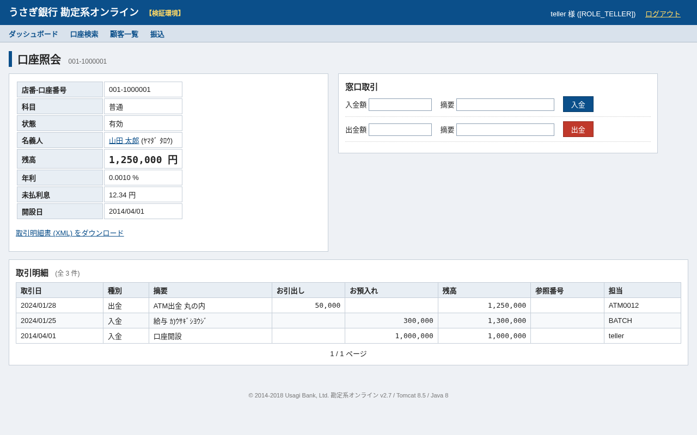
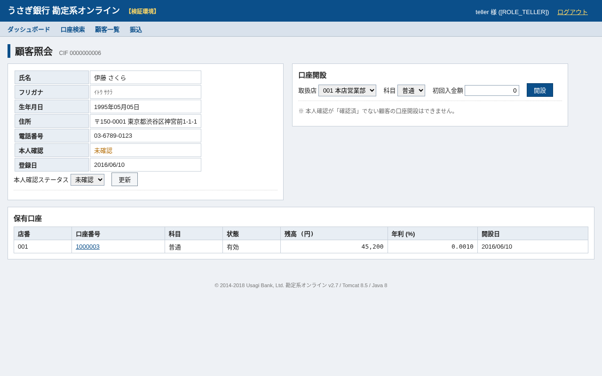

# うさぎ銀行 勘定系オンライン

**うさぎ銀行の勘定系システムです (架空の銀行)。** 営業店の行員が使う社内向け Web アプリで、顧客・口座の照会、窓口での入出金、口座間の振込、取引明細のダウンロードができます。日次バッチでは利息積数を計算し、ホストと固定長ファイルをやり取りします。権限はロールごとに分かれており、窓口担当 (teller) は取引を、管理者 (admin) はそれに加えて口座状態の変更とバッチを扱い、監査担当 (auditor) は照会のみ行えます。


| ダッシュボード | 口座照会 | 顧客照会 |
|---|---|---|
|  |  |  |

移行・モダナイゼーションのデモ対象として、あえて*レガシー*な構成にしています: **Spring Boot 1.5.22 / Java 8 / JSP + jQuery / JUnit 4 / H2 上の Oracle 方言 SQL / GnuCOBOL の日次バッチ / Jenkinsfile**。

2010 年代半ばの銀行システムにありがちな要素を意図的に盛り込んでいます: `javax.*`、`WebSecurityConfigurerAdapter`、Spring Data `findOne()`、Hibernate `Criteria`、Joda-Time、Ehcache 2、JAXB、`BigDecimal.ROUND_DOWN`、MS932 固定長ホストファイル、全銀の預金種目コード、そして 1 銭単位で同じファイルを出力し続けなければならない 1998 年製の COBOL プログラム。

## 業務機能

| 画面 / API | 内容 |
|---|---|
| ダッシュボード | 営業日, 店別残高, 残高上位顧客, 有効口座一覧 |
| 顧客 (CIF) | 検索・登録 (CIF 自動採番)・本人確認 (KYC) ステータス更新・口座開設 |
| 口座 | 店番 / 口座番号 / 科目 (普通 1・当座 2・貯蓄 4・定期 9) / 状態 (有効・凍結・休眠・解約) / 入出金 / 取引明細 (ページング) |
| 振込 | 同一店内 0 円, 他店宛 3 万円未満 110 円・3 万円以上 220 円, 1 日あたり振込限度額 (既定 100 万円), 楽観ロック + 口座ロック順序制御 |
| 明細 XML | JAXB による取引明細 XML (`/accounts/{店番}/{口座番号}/statement.xml`) |
| 利息 | 日次利息積数 (年利 ÷ 365, 銭未満切捨て), 半期利払い (2 月・8 月) |
| ホストファイル連携 | `ACCOUNTS.DAT` 出力 / `ACCRUED.DAT` 取込 (固定長 52 桁, MS932, H/D/T レコード, トレーラ件数照合) |
| 監査 | 全 API 呼出しの監査ログ (`AUDIT` ロガー), 操作者記録 |

REST API (`/usagi/api/**`, HTTP Basic 認証): `GET /api/accounts`, `GET /api/accounts/{branch}/{no}`, `GET .../transactions`, `GET .../statement.xml`, `POST /api/transfers`, `GET /api/customers`。管理者のみ: `GET /api/batch/accounts-file`, `POST /api/batch/accrued-file`, `POST /api/batch/eod`。

## 起動方法

必要なもの: JDK 8、Maven 3.x (COBOL バッチを動かす場合のみ GnuCOBOL `cobc`)。

```bash
JAVA_HOME=/usr/lib/jvm/java-8-openjdk-amd64 mvn spring-boot:run
# → http://localhost:8080/usagi/
```

デモユーザ (インメモリ, `SecurityConfig`):

| ユーザ | パスワード | ロール |
|---|---|---|
| `teller`  | `teller123` | TELLER (入出金・振込) |
| `admin`   | `admin123`  | ADMIN + TELLER (口座状態変更, バッチ API) |
| `auditor` | `audit123`  | AUDITOR (照会のみ) |

その他のエンドポイント: H2 コンソール `/usagi/h2-console` (JDBC URL `jdbc:h2:mem:usagi`, ユーザ `USAGI` / `usagi`)、Actuator `/usagi/manage/health`, `/usagi/manage/info`, `/usagi/manage/metrics`。

```bash
# API の例
curl -u teller:teller123 http://localhost:8080/usagi/api/accounts/001/1000001
curl -u teller:teller123 -H 'Content-Type: application/json' -d '{"fromBranchCode":"001","fromAccountNo":"1000001","toBranchCode":"002","toAccountNo":"2000001","amount":50000,"description":"家賃"}' http://localhost:8080/usagi/api/transfers
curl -u admin:admin123 -o ACCOUNTS.DAT http://localhost:8080/usagi/api/batch/accounts-file
```

## テスト

```bash
JAVA_HOME=/usr/lib/jvm/java-8-openjdk-amd64 mvn test        # 39 件 (JUnit 4, SpringRunner, H2 Oracle モード)
cd batch/cobol && ./run.sh                                     # UBEOD001 をコンパイル・実行し expected/ACCRUED.DAT と比較
```

| テスト | 検証内容 |
|---|---|
| `InterestServiceTest` | 日次利息計算 (ROUND_DOWN, 当座は無利息) |
| `TransferServiceIT` | 手数料, 限度額, 残高不足, 凍結口座, 同一口座振込 |
| `BatchFileServiceIT` | 固定長レイアウトのゴールデンファイル (`src/test/resources/golden/ACCOUNTS.DAT`), MS932, トレーラ照合 |
| `StatementServiceIT` | JAXB 明細 XML |
| `BankingApiIT` | 認証・ロール別認可・エラーコード (`UB-xxxx`)・日本語ラベル |
| `WebSecurityIT` | 画面フォーム POST のサーバ側ロール制御 (監査ロールは照会のみ), CSRF |
| `CobolParityTest` | Java の利息計算と COBOL `UBEOD001` の出力が 1 銭単位で一致すること |

ゴールデンファイルは `mvn test -Dgolden.argLine=-Dgolden.update=true` で再生成できます (`BatchFileServiceIT` 参照)。

## リポジトリ構成

```
pom.xml                          Spring Boot 1.5.22 親 POM, WAR パッケージ, Java 1.8
Jenkinsfile                      Jenkins 2.x 宣言型パイプライン (WebSphere ステージングへデプロイ)
src/main/java/jp/usagi/bank/
  config/                        SecurityConfig (WebSecurityConfigurerAdapter × 2), WebMvcConfig, AuditLogFilter
  domain/                        JPA エンティティ: Branch, Customer, Account, Transaction + 列挙型 (全銀コード)
  repository/                    Spring Data JPA + Hibernate Criteria (AccountRepositoryImpl) + Oracle ROWNUM ネイティブ SQL
  service/                       AccountService, TransferService, InterestService, BatchFileService, StatementService, ...
  web/                           JSP コントローラ (顧客 / 口座 / 振込 / ダッシュボード)
  api/                           REST コントローラ + DTO + ApiExceptionHandler (UB-xxxx エラーコード)
  batch/                         EndOfDayJob (@Scheduled 23:30 JST)
  xml/                           JAXB 明細モデル
src/main/resources/db/migration  Flyway 4: V1 スキーマ (Oracle DDL 方言), V2 初期データ (5 支店, 10 顧客, 15 口座)
src/main/webapp/WEB-INF/jsp      JSP/JSTL 画面 (日本語 UI) + jQuery 1.12.4
batch/cobol/UBEOD001.cbl         COBOL 日次利息積数バッチ (GnuCOBOL), data/, expected/, run.sh
docs/images/                     README 用スクリーンショット / GIF
```

## モダナイゼーションのトラック (デモシナリオ)

各トラック向けの改修ポイントをコードベースに仕込んであります。いずれも既存のテストスイートで検証でき、テストが移行前後の同等性を保証する契約になります。

### 1. Spring Boot 1.5 / Java 8 → Spring Boot 3 / Java 21 (メイン)

| 改修ポイント | 該当箇所 |
|---|---|
| `javax.persistence`, `javax.validation`, `javax.servlet`, `javax.xml.bind` → `jakarta.*` / JDK から削除された JAXB | 全エンティティ, フィルタ, `xml/` |
| `WebSecurityConfigurerAdapter`, `antMatchers`, `NoOpPasswordEncoder` 相当の平文インメモリユーザ, `security.*` プロパティ | `config/SecurityConfig.java`, `application.properties` |
| Spring Data `findOne(id)`, `new PageRequest(...)` | `service/*`, `repository/*` |
| Hibernate 5.0 `Criteria` / `Restrictions` / `Order` (Hibernate 6 で削除) | `repository/AccountRepositoryImpl.java` |
| `org.hibernate.validator.constraints.NotBlank` → `jakarta.validation.constraints.NotBlank` | `domain/Customer.java` |
| Flyway 4 (`flyway.*` → `spring.flyway.*`, `baseline-on-migrate`), H2 1.4 → 2.x, Ehcache 2 → JCache/Caffeine | `pom.xml`, `application.properties`, `ehcache.xml` |
| `server.context-path`, `spring.http.encoding.*`, `endpoints.*`/`management.security.enabled` → 新しい Actuator モデル | `application.properties` |
| `SpringBootServletInitializer` による WAR + JSP (Boot 3 + Tomcat でも JSP は動くが WAR の場合のみ) | `UsagiBankApplication.java`, `pom.xml` |
| JUnit 4 (`@RunWith(SpringRunner)`, `@Test(expected=...)`, Hamcrest 1.3) → JUnit 5 | `src/test` |
| Joda-Time → `java.time`, `BigDecimal.ROUND_DOWN` → `RoundingMode`, `new BigDecimal("...")` の書き方 | `service/*`, `BusinessDateService` |
| `Charset.forName("MS932")`, `IOUtils`, Stream を使わない Java 8 のループ → record, `var`, テキストブロック, `switch` 式 | `service/BatchFileService.java` |

### 2. COBOL バッチ → Java サービス
`batch/cobol/UBEOD001.cbl` は `InterestService` + `BatchFileService.importAccrued` のホスト側の双子です。`CobolParityTest` と `expected/ACCRUED.DAT` が、COBOL ステップを `POST /api/batch/eod` に置き換えるための契約になります。

### 3. JSP/jQuery → React/TypeScript
`web/*Controller` 配下に JSP 画面が 10 枚あり、同じ操作は REST API でも提供済みです。再実装が必要な jQuery の挙動 (全角数字の正規化, 口座名義の照会, テーブルのソート) は `static/js/usagi.js` にあります。

### 4. Oracle → PostgreSQL
`V1__create_schema.sql` は `VARCHAR2`, `NUMBER(p,s)`, `SYSDATE`, シーケンスを使用し、リポジトリは `NVL`, `ROWNUM`, `FROM DUAL` を使用しています。本番の Oracle 接続 URL は `application.properties` に記載されています。H2 は `MODE=Oracle` で動作します。

### 5. Jenkins → GitHub Actions
`Jenkinsfile` (宣言型, WebSphere `wsadmin` デプロイ, Nexus, SonarQube 5.6) → Maven/Temurin マトリクス + GnuCOBOL ステップを持つワークフロー。

## 注意
架空のデータを使ったデモシステムです。認証情報はインメモリのデモ用の値のみです。
